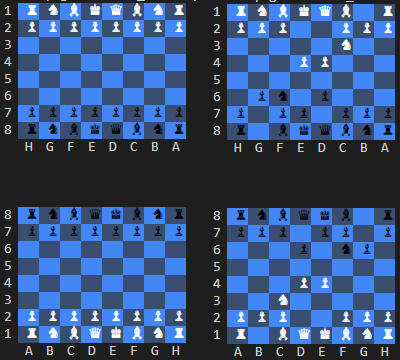

# Terminal Chess

Terminal Chess is a game of chess you and a friend can play against each other
using SSH.

Each player will play the board from their perspective.

Project status: In development, no playable version

## Installation

TBD

## How to play

* Use long algebraic notation to move pieces
* Movement format = starting square, ending square: `b2a3`
* Castling king side enter: `0-0` castling queen side enter: `0-0-0`
* To request a draw you can enter `draw` or `(=)`. Your opponent will have to 
  accept for the draw to go through
* To resign enter `resign` or `xx`
